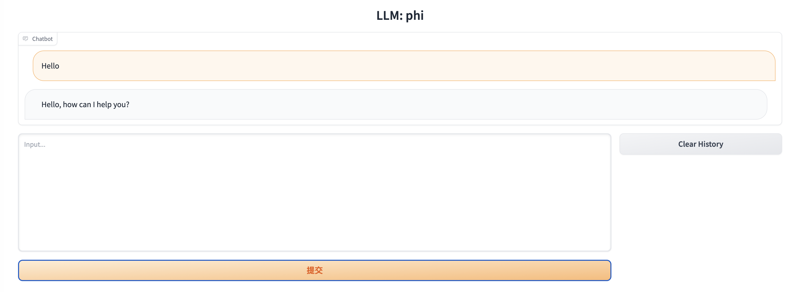
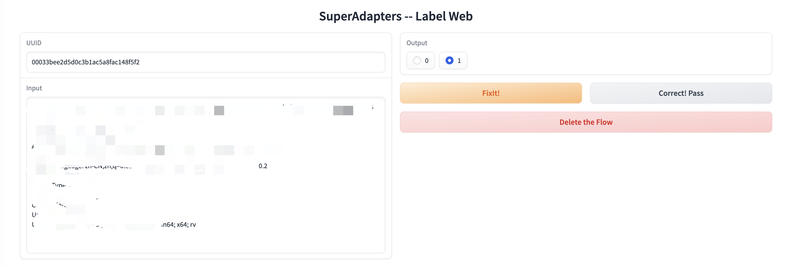
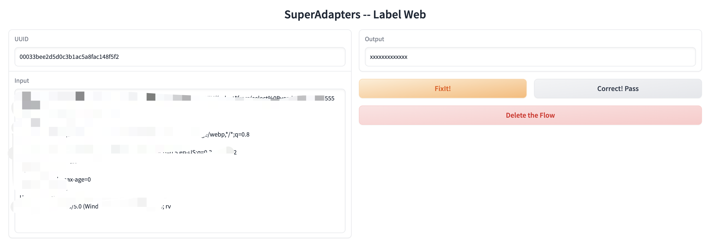

# SuperAdapters

Finetune ALL LLMs with ALL Adapeters on ALL Platforms!

## Support

| Model    | LoRA               | QLoRA                | AdaLoRA              | Prefix Tuning           | P-Tuning                | Prompt Tuning           |
|----------| ------------------ |----------------------|----------------------|-------------------------|-------------------------|-------------------------|
| Bloom    | :white_check_mark: | :white_check_mark:   | :white_check_mark:   | :white_check_mark:      | :white_check_mark:      | :white_check_mark:      |
| LLaMA    | :white_check_mark: | :white_check_mark:   | :white_check_mark:   | :white_check_mark:      | :white_check_mark:      | :white_check_mark:      |
| LLaMA2   | :white_check_mark: | :white_check_mark:   | :white_check_mark:   | :white_check_mark:      | :white_check_mark:      | :white_check_mark:      |
| ChatGLM  | :white_check_mark: | :white_check_mark:   | :white_check_mark:   | :ballot_box_with_check: | :ballot_box_with_check: | :ballot_box_with_check: |
| ChatGLM2 | :white_check_mark: | :white_check_mark:   | :white_check_mark:   | :ballot_box_with_check: | :ballot_box_with_check: | :ballot_box_with_check: |
| Qwen     | :white_check_mark: | :white_check_mark:   | :white_check_mark:   | :white_check_mark:      | :white_check_mark:      | :white_check_mark:      |
| Baichuan | :white_check_mark: | :white_check_mark:   | :white_check_mark:   | :white_check_mark:      | :white_check_mark:      | :white_check_mark:      |
| Mistrial | :white_check_mark: | :white_check_mark:   | :white_check_mark:   | :white_check_mark:      | :white_check_mark:      | :white_check_mark:      |
| Phi      | :white_check_mark: | :white_check_mark:   | :white_check_mark:   | :white_check_mark:      | :white_check_mark:      | :white_check_mark:      |

**You can Finetune LLM on** 
- Windows
- Linux
- Mac M1/2

**You can Handle train / test Data with**
- Terminal
- File
- DataBase

**You can Do various Task**
- CausalLM (default)
- SequenceClassification

*P.S. Unfortunately, SuperAdapters do not support qlora on Mac, please use lora/adalora instead.*

## Requirement

CentOS:

```bash
yum install -y xz-devel
```

Ubuntu:
```bash
apt-get install -y liblzma-dev
```

MacOS:
```bash
brew install xz
```

*P.S. Maybe you should recompile the python with xz* 

```bash
CPPFLAGS="-I$(brew --prefix xz)/include" pyenv install 3.10.0
```

If you want to use gpu on Mac, Please read [How to use GPU on Mac](./MacGPUEnv.md)

```shell
pip install --pre torch torchvision torchaudio --extra-index-url https://download.pytorch.org/whl/nightly/cpu
pip install -r requirements.txt
```

## LLMs

| Model    | Download Link |
|----------| ---- |
| Bloom    | [https://huggingface.co/bigscience/bloom-560m](https://huggingface.co/bigscience/bloom-560m) |
| LLaMA    | [https://huggingface.co/openlm-research/open_llama_3b_600bt_preview](https://huggingface.co/openlm-research/open_llama_3b_600bt_preview) |
| LLaMA2   | [https://huggingface.co/meta-llama/Llama-2-13b-hf](https://huggingface.co/meta-llama/Llama-2-13b-hf) |
| Vicuna   | [https://huggingface.co/lmsys/vicuna-7b-delta-v1.1](https://huggingface.co/lmsys/vicuna-7b-delta-v1.1) |
| ChatGLM  | [https://huggingface.co/THUDM/chatglm-6b](https://huggingface.co/THUDM/chatglm-6b) |
| ChatGLM2 | [https://huggingface.co/THUDM/chatglm2-6b](https://huggingface.co/THUDM/chatglm2-6b) |
| Qwen     | [https://huggingface.co/Qwen/Qwen-7B-Chat](https://huggingface.co/Qwen/Qwen-7B-Chat) |
| Mistrial | [https://huggingface.co/mistralai/Mistral-7B-Instruct-v0.2](https://huggingface.co/mistralai/Mistral-7B-Instruct-v0.2) |
| Phi      | [https://huggingface.co/microsoft/phi-2](https://huggingface.co/microsoft/phi-2) |

## Finetune Data Format

[Here is an example](data/train/example.json)

## Usage

### ChatGLM with lora

```bash
python finetune.py --model_type chatglm --data "data/train/" --model_path "LLMs/chatglm/chatglm-6b/" --adapter "lora" --output_dir "output/chatglm"
```

```bash
python inference.py --model_type chatglm --instruction "Who are you?" --model_path "LLMs/chatglm/chatglm-6b/" --adapter_weights "output/chatglm" --max_new_tokens 32
```

### LLaMa with lora

```bash
python finetune.py --model_type llama --data "data/train/" --model_path "LLMs/open-llama/open-llama-3b/" --adapter "lora" --output_dir "output/llama"
```

```bash
python inference.py --model_type llama --instruction "Who are you?" --model_path "LLMs/open-llama/open-llama-3b" --adapter_weights "output/llama" --max_new_tokens 32
```

### Bloom with lora

```bash
python finetune.py --model_type bloom --data "data/train/" --model_path "LLMs/bloom/bloomz-560m" --adapter "lora" --output_dir "output/bloom"
```

```bash
python inference.py --model_type bloom --instruction "Who are you?" --model_path "LLMs/bloom/bloomz-560m" --adapter_weights "output/bloom" --max_new_tokens 32
```

### Qwen with lora

```bash
python finetune.py --model_type qwen --data "data/train/" --model_path "LLMs/Qwen/Qwen-7b-chat" --adapter "lora" --output_dir "output/Qwen"
```

```bash
python inference.py --model_type qwen --instruction "Who are you?" --model_path "LLMs/Qwen/Qwen-7b-chat" --adapter_weights "output/Qwen" --max_new_tokens 32
```

### Baichuan with lora

```bash
python finetune.py --model_type baichuan --data "data/train/" --model_path "LLMs/baichuan/baichuan-7b" --adapter "lora" --output_dir "output/baichuan"
```

```bash
python inference.py --model_type baichuan --instruction "Who are you?" --model_path "LLMs/baichuan/baichuan-7b" --adapter_weights "output/baichuan" --max_new_tokens 32
```

### Mistrial with lora

```bash
python finetune.py --model_type mistrial --data "data/train/" --model_path "LLMs/mistrial/mistrial-7b" --adapter "lora" --output_dir "output/mistrial"
```

```bash
python inference.py --model_type mistrial --instruction "Who are you?" --model_path "LLMs/mistrial/mistrial-7b" --adapter_weights "output/mistrial" --max_new_tokens 32
```

### Phi with lora

```bash
python finetune.py --model_type phi --data "data/train/" --model_path "LLMs/phi/phi-2" --adapter "lora" --output_dir "output/phi"
```

```bash
python inference.py --model_type phi --instruction "Who are you?" --model_path "LLMs/phi/phi-2" --adapter_weights "output/phi" --max_new_tokens 32
```

### Use Classify Mode

You need to specify task_type('classify') and labels

```bash
python finetune.py --model_type llama --data "data/train/alpaca_tiny_classify.json" --model_path "LLMs/open-llama/open-llama-3b" --adapter "lora" --output_dir "output/llama" --task_type classify --labels '["0", "1"]' --disable_wandb
```

```bash
python inference.py --model_type llama --data "data/train/alpaca_tiny_classify.json" --model_path "LLMs/open-llama/open-llama-3b" --adapter_weights "output/llama" --task_type classify --labels '["0", "1"]' --disable_wandb
```

### Use DataBase

1. You need to install a MySQL, and put the db config into the system env.

Eg. 

```
export LLM_DB_HOST='127.0.0.1'
export LLM_DB_PORT=3306
export LLM_DB_USERNAME='YOURUSERNAME'
export LLM_DB_PASSWORD='YOURPASSWORD'
export LLM_DB_NAME='YOURDBNAME'
```

2. create the necessary tables

[Here is the sql files](./sql/)

```sql
source xxxx.sql
```

- db_iteration: [train/test] The record's set name.
- db_type: [test] The record is whether "train" or "test".
- db_test_iteration: [test] The record's test set name.

3. finetune (use chatglm for example)

```shell
python finetune.py --model_type chatglm --fromdb --db_iteration xxxxxx --model_path "LLMs/chatglm/chatglm-6b/" --adapter "lora" --output_dir "output/chatglm" --disable_wandb
```

4. eval

```shell
python inference.py --model_type chatglm --fromdb --db_iteration xxxxxx --db_type 'test' --db_test_iteration yyyyyyy --model_path "LLMs/chatglm/chatglm-6b/" --adapter_weights "output/chatglm" --max_new_tokens 6
```


## Params

### Finetune

```shell
usage: finetune.py [-h] [--data DATA] [--model_type {llama,llama2,chatglm,chatglm2,bloom,qwen,baichuan}] [--task_type {seq2seq,classify}] [--labels LABELS] [--model_path MODEL_PATH]
                   [--output_dir OUTPUT_DIR] [--disable_wandb] [--adapter {lora,qlora,adalora,prompt,p_tuning,prefix}] [--lora_r LORA_R] [--lora_alpha LORA_ALPHA] [--lora_dropout LORA_DROPOUT]
                   [--lora_target_modules LORA_TARGET_MODULES [LORA_TARGET_MODULES ...]] [--adalora_init_r ADALORA_INIT_R] [--adalora_tinit ADALORA_TINIT] [--adalora_tfinal ADALORA_TFINAL]
                   [--adalora_delta_t ADALORA_DELTA_T] [--num_virtual_tokens NUM_VIRTUAL_TOKENS] [--mapping_hidden_dim MAPPING_HIDDEN_DIM] [--epochs EPOCHS] [--learning_rate LEARNING_RATE]
                   [--cutoff_len CUTOFF_LEN] [--val_set_size VAL_SET_SIZE] [--group_by_length] [--logging_steps LOGGING_STEPS] [--load_8bit] [--add_eos_token]
                   [--resume_from_checkpoint [RESUME_FROM_CHECKPOINT]] [--per_gpu_train_batch_size PER_GPU_TRAIN_BATCH_SIZE] [--gradient_accumulation_steps GRADIENT_ACCUMULATION_STEPS] [--fromdb]
                   [--db_iteration DB_ITERATION]

Finetune for all.

optional arguments:
  -h, --help            show this help message and exit
  --data DATA           the data used for instructing tuning
  --model_type {llama,llama2,chatglm,chatglm2,bloom,qwen,baichuan,mistrial,phi}
  --task_type {seq2seq,classify}
  --labels LABELS       Labels to classify, only used when task_type is classify
  --model_path MODEL_PATH
  --output_dir OUTPUT_DIR
                        The DIR to save the model
  --disable_wandb       Disable report to wandb
  --adapter {lora,qlora,adalora,prompt,p_tuning,prefix}
  --lora_r LORA_R
  --lora_alpha LORA_ALPHA
  --lora_dropout LORA_DROPOUT
  --lora_target_modules LORA_TARGET_MODULES [LORA_TARGET_MODULES ...]
                        the module to be injected, e.g. q_proj/v_proj/k_proj/o_proj for llama, query_key_value for bloom&GLM
  --adalora_init_r ADALORA_INIT_R
  --adalora_tinit ADALORA_TINIT
                        number of warmup steps for AdaLoRA wherein no pruning is performed
  --adalora_tfinal ADALORA_TFINAL
                        fix the resulting budget distribution and fine-tune the model for tfinal steps when using AdaLoRA
  --adalora_delta_t ADALORA_DELTA_T
                        interval of steps for AdaLoRA to update rank
  --num_virtual_tokens NUM_VIRTUAL_TOKENS
  --mapping_hidden_dim MAPPING_HIDDEN_DIM
  --epochs EPOCHS
  --learning_rate LEARNING_RATE
  --cutoff_len CUTOFF_LEN
  --val_set_size VAL_SET_SIZE
  --group_by_length
  --logging_steps LOGGING_STEPS
  --load_8bit
  --add_eos_token
  --resume_from_checkpoint [RESUME_FROM_CHECKPOINT]
                        resume from the specified or the latest checkpoint, e.g. `--resume_from_checkpoint [path]` or `--resume_from_checkpoint`
  --per_gpu_train_batch_size PER_GPU_TRAIN_BATCH_SIZE
                        Batch size per GPU/CPU for training.
  --gradient_accumulation_steps GRADIENT_ACCUMULATION_STEPS
  --fromdb
  --db_iteration DB_ITERATION
                        The record's set name.
```

## Generate

```shell
usage: inference.py [-h] [--debug] [--web] [--instruction INSTRUCTION] [--input INPUT] [--data DATA] [--model_type {llama,llama2,chatglm,chatglm2,bloom,qwen,baichuan,mistrial,phi}]
                    [--task_type {seq2seq,classify}] [--labels LABELS] [--model_path MODEL_PATH] [--adapter_weights ADAPTER_WEIGHTS] [--load_8bit] [--temperature TEMPERATURE] [--top_p TOP_P] [--top_k TOP_K]
                    [--max_new_tokens MAX_NEW_TOKENS] [--fromdb] [--db_type DB_TYPE] [--db_iteration DB_ITERATION] [--db_test_iteration DB_TEST_ITERATION]

Inference for all.

optional arguments:
  -h, --help            show this help message and exit
  --debug               Debug Mode to output detail info
  --web                 Web Demo to try the inference
  --instruction INSTRUCTION
  --input INPUT
  --data DATA           The DIR of test data
  --model_type {llama,llama2,chatglm,chatglm2,bloom,qwen,baichuan,mistrial,phi}
  --task_type {seq2seq,classify}
  --labels LABELS       Labels to classify, only used when task_type is classify
  --model_path MODEL_PATH
  --adapter_weights ADAPTER_WEIGHTS
                        The DIR of adapter weights
  --load_8bit
  --temperature TEMPERATURE
                        temperature higher, LLM is more creative
  --top_p TOP_P
  --top_k TOP_K
  --max_new_tokens MAX_NEW_TOKENS
  --fromdb
  --db_type DB_TYPE     The record is whether 'train' or 'test'.
  --db_iteration DB_ITERATION
                        The record's set name.
  --db_test_iteration DB_TEST_ITERATION
                        The record's test set name.
```

## Inference Web

Add the "--web" parameter

```shell
python inference.py --model_type phi --model_path "LLMs/phi/phi-2" --web
```



## Label Web

### Classify

```shell
python web/label.py
```



### Chat

```shell
python web/label.py --type chat
```



## Reference

- https://github.com/AGI-Edgerunners/LLM-Adapters
- https://github.com/PhoebusSi/Alpaca-CoT
- https://transformers.run/
- https://www.mikecaptain.com/2023/01/22/captain-aigc-1-transformer/
